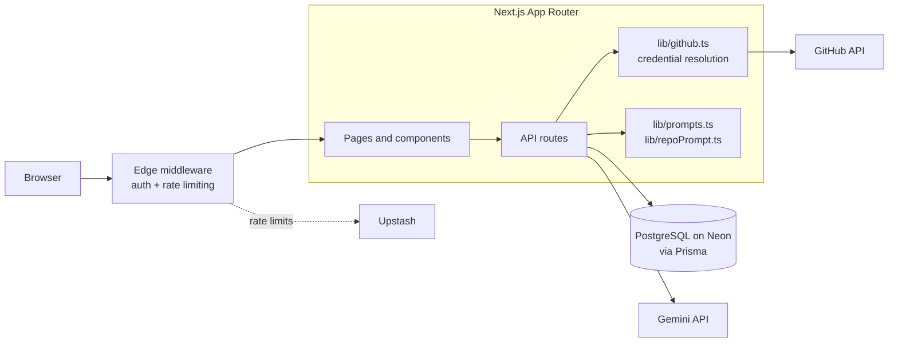
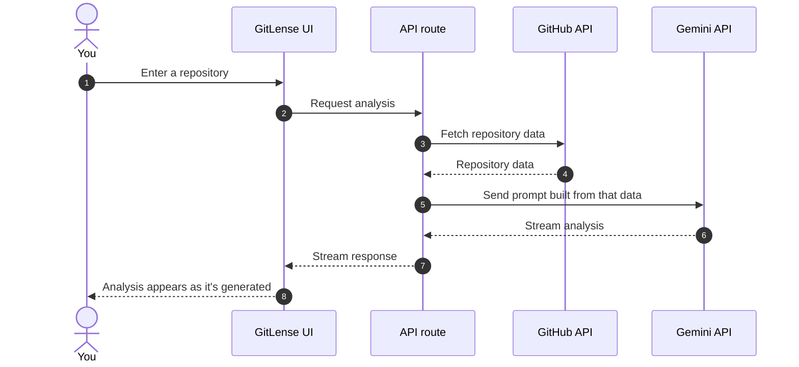
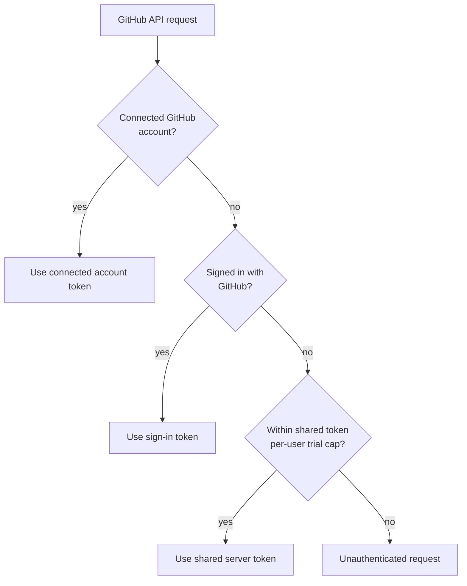
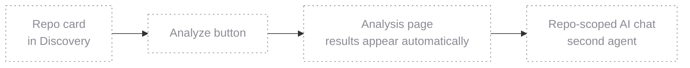

```mermaid
flowchart LR
    subgraph Discover["1 · Discover"]
        Hunt["Hunt"]:::available
        Trending["Trending"]:::available
    end
    subgraph Understand["2 · Understand"]
        Explainer["Repo Explainer"]:::available
        GitLense["GitLense"]:::available
        GodMode["God Mode"]:::experimental
    end
    subgraph Decide["3 · Decide"]
        Strategist["Bounty Strategist"]:::experimental
        Radar["Bounty Hunter Radar"]:::inprogress
        Ghost["Ghost Town Detector"]:::inprogress
    end
    Discover --> Understand --> Decide --> Analysis["Repo Analysis"]:::planned

    classDef available fill:#a8ff3e,stroke:#6fae1f,color:#0b0b0b
    classDef experimental fill:#ffb84d,stroke:#c88a26,color:#0b0b0b
    classDef inprogress fill:#3a3a40,stroke:#8a8a93,color:#f4f4f5,stroke-dasharray:4 3
    classDef planned fill:none,stroke:#8a8a93,color:#8a8a93,stroke-dasharray:2 4
```

<div align="center">

# OSHunt

**Turn GitHub noise into contribution signal.**

A GitHub-focused discovery and repository analysis project — built to help developers find repos and issues worth their time, and understand them before investing it.

Status: active development. Every feature below is labeled **Available**, **Experimental**, **In progress**, or **Planned**.

[Overview](#overview) · [Features](#key-features) · [Architecture](#architecture) · [Getting started](#getting-started) · [Roadmap](#roadmap) · [Contributing](#contributing)

[](#roadmap)
[](https://nextjs.org)
[](https://www.typescriptlang.org)
[](https://www.prisma.io)
[](LICENSE)

</div>

<p align="center">
  
  
</p>
<p align="center">
  
  
</p>
<p align="center"><sub>Illustrative wireframes of Hunt, GitLense, Trending, and God Mode, drawn with OSHunt's design tokens. They show layout, not real data or screenshots.</sub></p>

---

## Overview

OSHunt helps developers decide where to spend their open source time. It pairs filtered issue discovery with AI-assisted repository analysis, so you can find a project, understand how it's built, and judge whether it's worth contributing to — before you fork anything.

It's in active development, so each feature is labeled by where it actually stands:

| Label | Meaning |
| --- | --- |
| **Available** | Working in the current build |
| **Experimental** | Implemented, but still being tested and refined |
| **In progress** | Partly built |
| **Planned** | Not started yet |

## Problem and solution

**The problem.** Open source is easy to find and hard to evaluate. Searching by stars rewards popularity over fit, and judging a project means opening a dozen tabs, skimming code to guess at its architecture, and scrolling commit history to see whether it's still alive — all before you've written a line.

**The approach.** OSHunt aims to compress that evaluation step. Hunt narrows issues to work that fits your interests and skill level, GitLense analyzes a repository's architecture and quality, and Trending's Repo Explainer summarizes what a project does. It's not just a search box — it's a way to make a contribution decision with more signal and less tab-hopping. Tools for weighing effort against payoff are [experimental](#experimental) or [in progress](#in-progress).

### How it fits together

The tools follow the way a contribution decision actually unfolds: find something, understand it, then decide. Colors show where each one stands today.



<sub>Green: Available · Amber: Experimental · Grey, dashed: In progress · Outline: Planned. Career Hub, an experimental profile-scoring tool, sits alongside this flow rather than inside it.</sub>

## Key features

### Available

| Feature | What it does |
| --- | --- |
| **Hunt** | Filtered search for open source issues, narrowed to work that matches your interests and skill level. |
| **GitLense** | AI analysis of a repository's architecture and quality, streamed as it's generated. |
| **Trending** | Real-time GitHub search with a built-in Repo Explainer that summarizes what a project does and how it's put together. |

### Experimental

Implemented, but still being tested and refined — expect rough edges.

| Feature | What it does |
| --- | --- |
| **God Mode** | A terminal-style AI that answers as a Senior Enterprise Architect, for design, trade-off, and structure questions. |
| **Bounty Strategist** | Contribution ROI analysis that weighs effort against payoff for bounty-bearing issues. |
| **Career Hub** | Scores a GitHub profile and offers AI mentor guidance on what to improve. |

### In progress

Partly built, and not something to rely on yet.

| Feature | What it aims to do |
| --- | --- |
| **Bounty Hunter Radar** | Keep watch on bounty-bearing issues so good ones don't slip past you. |
| **Ghost Town Detector** | Flag repositories that look abandoned before you invest time in them. |
| **Contact and feedback page** | Give users a place to share feedback. The UI is built; the backend is being wired up. |

Planned work lives in the [roadmap](#roadmap).

## Built for

| If you're... | OSHunt is designed to help you... |
| --- | --- |
| A beginner exploring open source | Find approachable issues and get a plain-language explanation of a repo before you fork it |
| An experienced developer looking for meaningful work | Filter past the noise and weigh effort against payoff before you commit |
| A contributor looking for a good-fit repository | Discover projects that match your stack and interests |
| A team evaluating projects or onboarding into a stack | Get a fast architectural read on a repository |

## Tech stack

| Layer | Technology |
| --- | --- |
| Framework | Next.js (App Router), React, TypeScript |
| UI | Tailwind CSS, shadcn/ui |
| Database | PostgreSQL on Neon, Prisma ORM |
| Auth | Auth.js v5 |
| AI | Google Gemini API |
| Rate limiting | Upstash |
| Hosting | Vercel |

## Architecture

### System overview

Requests hit edge middleware first, then the App Router, where pages call API routes that talk to PostgreSQL through Prisma, to GitHub for repo data, and to Gemini for analysis. Shared logic lives in `lib/`, so the AI features share the same terminal, prompt, and GitHub plumbing.



### Request flow

A simplified look at what happens when GitLense analyzes a repository — the response streams back as it's generated rather than arriving in one piece.



### GitHub credential resolution

GitHub requests resolve credentials in a fixed order and fall back step by step, ending in an unauthenticated request as a last resort.



### Constraints worth knowing

Prisma never runs in Edge Middleware — it's a hard boundary, so middleware stays limited to session checks and rate limiting. And API routes stay out of middleware's redirect logic, because clients calling them expect JSON and an HTML redirect breaks `res.json()`.

## Getting started

### Prerequisites

You'll need Node.js 20 or newer, a PostgreSQL database (a free Neon project works well), a GitHub OAuth App, and a Gemini API key.

### Local setup

```bash
git clone https://github.com/<your-username>/oshunt.git
cd oshunt
npm install
cp .env.example .env.local
npx prisma migrate dev
npm run dev        # http://localhost:3000
```

Set your GitHub OAuth App's callback URL to `http://localhost:3000/api/auth/callback/github`. Use `npm run build` for a production build and `npm run lint` before opening a pull request.

### Environment variables

Fill in `.env.local` and never commit `.env` files.

| Variable | Purpose | Where to get it |
| --- | --- | --- |
| `DATABASE_URL` | PostgreSQL connection string | [Neon](https://neon.tech) project dashboard |
| `AUTH_SECRET` | Auth.js session secret | `openssl rand -base64 32` |
| `AUTH_GITHUB_ID`, `AUTH_GITHUB_SECRET` | GitHub OAuth App for sign-in | [GitHub Developer Settings](https://github.com/settings/developers) |
| `AUTH_GOOGLE_ID`, `AUTH_GOOGLE_SECRET` | Google sign-in credentials, if Google sign-in is enabled | [Google Cloud Console](https://console.cloud.google.com/apis/credentials) |
| `GITHUB_CONNECT_CLIENT_ID`, `GITHUB_CONNECT_CLIENT_SECRET` | Separate GitHub OAuth App for account connection | GitHub Developer Settings (a second OAuth App) |
| `TOKEN_ENCRYPTION_KEY` | 32-byte key for AES-256-GCM token encryption | Any secure random generator |
| `GITHUB_TOKEN` | Server-side token for limited GitHub API access | A GitHub personal access token |
| `GEMINI_API_KEY` | Google Gemini API access | [Google AI Studio](https://aistudio.google.com/apikey) |
| `UPSTASH_REDIS_REST_URL`, `UPSTASH_REDIS_REST_TOKEN` | Rate limiting | [Upstash Console](https://console.upstash.com) |

<details>
<summary><b>Project structure</b></summary>

```text
oshunt/
├── app/                 # App Router pages and API routes
├── components/          # Shared UI, including the marketing and in-app navbars
├── docs/assets/         # README wireframes
├── lib/
│   ├── architect.ts     # Shared AI architect logic
│   ├── terminal.tsx     # Shared terminal UI
│   ├── github.ts        # GitHub API client and credential resolution
│   ├── prompts.ts       # Prompt templates
│   └── repoPrompt.ts    # Repository analysis prompt builder
├── prisma/              # Schema and migrations
└── middleware.ts        # Edge middleware: auth and rate limiting (no Prisma)
```

</details>

## Roadmap

| Phase | Focus |
| --- | --- |
| **Now** | Finish the in-progress tools (Bounty Hunter Radar, Ghost Town Detector, contact and feedback page) and stabilize the experimental ones. |
| **Next** | **Repo Analysis** *(planned)* — a dedicated analysis page for a single repo, with a second AI agent for questions scoped to that repo. |

**Repo Analysis** is the next planned piece, and none of it is built yet. The intended flow: one click from a repo card in Discovery opens an analysis page, which automatically explains in simple words how to approach contributing to that repo.



## Security

The codebase includes a set of baseline protections: GitHub connection tokens are encrypted with AES-256-GCM, the OAuth connection flow validates a CSRF state, OSHunt's own routes are rate limited through Upstash, and security headers are set. Security work is ongoing as the project evolves.

Found a vulnerability? Please report it privately through GitHub's private vulnerability reporting on the repository's Security tab instead of opening a public issue.

## Contributing

OSHunt exists to help people contribute to open source — so contributions are welcome. Fork the repo, create a feature branch, make your change, and open a pull request with a clear description of what changed and why. Two ground rules keep the codebase consistent: stick to the design tokens below, and keep Prisma out of middleware.

<details>
<summary><b>Design tokens</b></summary>

OSHunt is dark-first and deliberately minimal.

| Token | Value |
| --- | --- |
| Background | `#090909` |
| Accent | `#a8ff3e` (lime) |
| Bounty accent | `#ffb84d` (amber) |
| Typeface | Outfit |
| Card surface | `bg-white/[0.02]` |
| Icons | Inline SVGs only — no icon libraries, no emojis |

</details>

## License

Distributed under the MIT License. See [LICENSE](LICENSE) for details.

## Author

Built by Ayush, a solo developer building in public. Find me on X at [@AyushdevX](https://x.com/AyushdevX) or check out the [portfolio](https://ayushdevx.netlify.app).

<div align="center">

If the project's useful or interesting to you, a star helps other developers find it. Appreciate it.

</div>