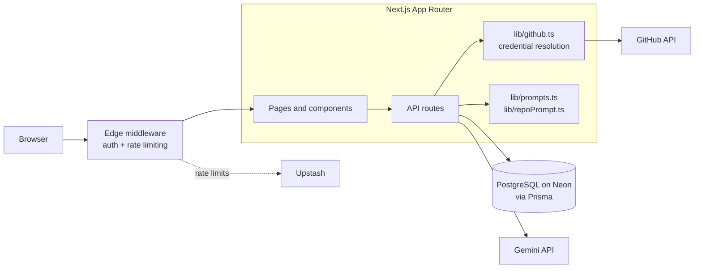
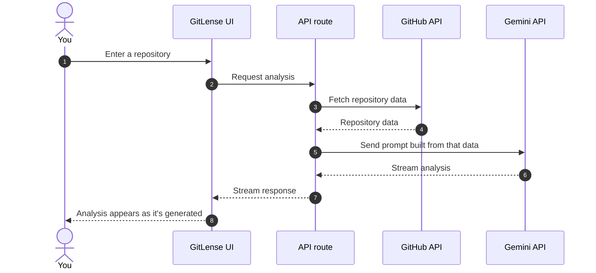
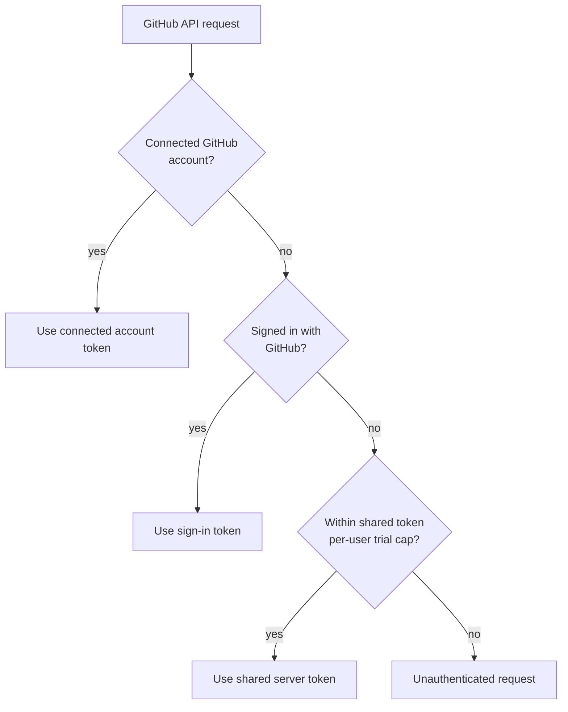
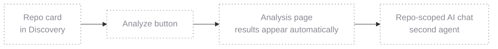

<div align="center">

# OSHunt

**Discover open source work and evaluate repos before you invest time in them.**

An early-stage developer tool for GitHub — filtered issue search, repository overviews, and a few experiments in contribution decision support. Under active development.

[Overview](#overview) · [How it works](#how-it-works) · [Feature status](#current-feature-status) · [Architecture](#architecture) · [Getting started](#getting-started) · [Roadmap](#roadmap) · [Contributing](#contributing)

[](#current-feature-status)
[](https://nextjs.org)
[](https://www.typescriptlang.org)
[](LICENSE)

</div>

> [!NOTE]
> OSHunt is in active development and is not a finished platform. Features are labeled by status below — expect rough edges, and expect things to change.

<p align="center">
  
  
</p>
<p align="center">
  
  
</p>
<p align="center"><sub>Illustrative wireframes (layout sketches with placeholder content) drawn with OSHunt's design tokens. They are not screenshots.</sub></p>

---

## Overview

OSHunt helps developers find open source work and get a quick read on a repository before committing time to it. It combines filtered issue search with a handful of tools — some working, some experimental, some still being built — for understanding what a project does and whether it's worth contributing to.

The project is early-stage. The [feature status](#current-feature-status) table is the source of truth for what works today; everything else is experimental, in progress, or planned.

## Problem and solution

**The problem.** Finding open source work worth doing takes more effort than it should. Searching by stars favors popular projects over well-matched ones, and judging a repo means opening tabs, skimming code to guess at its structure, and checking commit history to see whether it's still maintained — all before you've written a line.

**What OSHunt is trying to do.** Shorten that evaluation step. Hunt filters issues, GitLense generates a written overview of a repository's architecture and quality, and Trending's Repo Explainer summarizes what a project does. These tools are aids for reaching a decision faster — not a replacement for reading the code yourself.

## How it works

OSHunt follows the order a contribution decision tends to take: find something, understand it, then decide whether it's worth your time. Colors show where each tool stands today.

```mermaid
flowchart LR
    subgraph Discover["1 · Discover"]
        Hunt["Hunt"]:::available
        Trending["Trending"]:::available
    end
    subgraph Understand["2 · Understand"]
        Explainer["Repo Explainer"]:::available
        GitLense["GitLense"]:::available
        GodMode["God Mode"]:::experimental
    end
    subgraph Decide["3 · Decide"]
        Strategist["Bounty Strategist"]:::experimental
        Radar["Bounty Hunter Radar"]:::inprogress
        Ghost["Ghost Town Detector"]:::inprogress
    end
    Discover --> Understand --> Decide --> Analysis["Repo Analysis"]:::planned

    classDef available fill:#a8ff3e,stroke:#6fae1f,color:#0b0b0b
    classDef experimental fill:#ffb84d,stroke:#c88a26,color:#0b0b0b
    classDef inprogress fill:#3a3a40,stroke:#8a8a93,color:#f4f4f5,stroke-dasharray:4 3
    classDef planned fill:none,stroke:#8a8a93,color:#8a8a93,stroke-dasharray:2 4
```



<sub>Green: Available · Amber: Experimental · Grey, dashed: In progress · Outline: Planned. Career Hub and the GitHub account connection are experimental and sit alongside this flow rather than inside it.</sub>

## Current feature status

`Available` working in the current codebase, though rough edges are possible · `Experimental` implemented, but still being tested and likely to change · `In progress` partly built, not ready to rely on · `Planned` not built yet

| Feature | Status | What it does today |
| --- | --- | --- |
| **Hunt** | `Available` | Searches open source issues with filters, so you can narrow down work that matches your interests and skill level. |
| **GitLense** | `Available` | Generates a written analysis of a repository's architecture and quality using the Gemini API, streamed as it's produced. |
| **Trending** | `Available` | Browses and searches GitHub repositories, with a Repo Explainer that summarizes what a project does. |
| **God Mode** | `Experimental` | A terminal-style chat that answers in the voice of a senior enterprise architect, for design and trade-off questions. |
| **Bounty Strategist** | `Experimental` | Produces a contribution ROI analysis for bounty-bearing issues, weighing effort against payoff. |
| **Career Hub** | `Experimental` | Scores a GitHub profile and gives feedback from an AI mentor. |
| **GitHub account connection** | `Experimental` | An optional OAuth connection, separate from sign-in, so GitHub requests can be made with your own token. |
| **Bounty Hunter Radar** | `In progress` | Aims to keep track of bounty-bearing issues. |
| **Ghost Town Detector** | `In progress` | Aims to flag repositories that look abandoned. |
| **Contact and feedback page** | `In progress` | The UI is built; the backend is being wired up. |
| **Repo Analysis** | `Planned` | A dedicated analysis page for a single repo, with a repo-scoped chat. See the [roadmap](#roadmap). |

### Known limitations

Output from the AI-assisted tools (GitLense, God Mode, Career Hub) can be inaccurate or incomplete, so treat it as a starting point and check it against the code. GitHub API rate limits can also affect results, and features in the `Experimental` and `In progress` groups may change or break as the project evolves.

## Built for

| If you're... | OSHunt aims to help you... |
| --- | --- |
| A beginner exploring open source | Find approachable issues and read a plain-language summary of a repo before you fork it |
| An experienced developer looking for meaningful work | Filter out noise and weigh effort against payoff |
| A contributor looking for a good-fit repository | Find projects that match your stack and interests |
| A team evaluating a project or onboarding into a stack | Get a quick architectural overview of a repository |

## Tech stack

| Layer | Technology |
| --- | --- |
| Framework | Next.js (App Router), React, TypeScript |
| UI | Tailwind CSS, shadcn/ui |
| Database | PostgreSQL on Neon, Prisma ORM |
| Auth | Auth.js v5 |
| AI | Google Gemini API |
| Rate limiting | Upstash |
| Hosting | Vercel |

## Architecture

### System overview

Requests hit edge middleware first, then the App Router, where pages call API routes that talk to PostgreSQL through Prisma, to GitHub for repo data, and to Gemini for analysis. Shared logic lives in `lib/`, so the AI-assisted tools share the same terminal, prompt, and GitHub plumbing.



### Example: GitLense request flow

A simplified look at what happens when GitLense analyzes a repository. The response streams back as it's generated rather than arriving in one piece.



### GitHub credential resolution

GitHub requests resolve credentials in a fixed order and fall back step by step, ending in an unauthenticated request as a last resort.



### Constraints worth knowing

Prisma never runs in Edge Middleware — it's a hard boundary, so middleware stays limited to session checks and rate limiting. And API routes stay out of middleware's redirect logic, because clients calling them expect JSON and an HTML redirect breaks `res.json()`.

## Getting started

### Prerequisites

You'll need Node.js 20 or newer, a PostgreSQL database (a free Neon project works well), a GitHub OAuth App, and a Gemini API key.

### Local setup

```bash
git clone https://github.com/<your-username>/oshunt.git
cd oshunt
npm install
cp .env.example .env.local
npx prisma migrate dev
npm run dev        # http://localhost:3000
```

Set your GitHub OAuth App's callback URL to `http://localhost:3000/api/auth/callback/github`. Use `npm run build` for a production build and `npm run lint` before opening a pull request.

### Environment variables

Fill in `.env.local` and never commit `.env` files.

| Variable | Purpose | Where to get it |
| --- | --- | --- |
| `DATABASE_URL` | PostgreSQL connection string | [Neon](https://neon.tech) project dashboard |
| `AUTH_SECRET` | Auth.js session secret | `openssl rand -base64 32` |
| `AUTH_GITHUB_ID`, `AUTH_GITHUB_SECRET` | GitHub OAuth App for sign-in | [GitHub Developer Settings](https://github.com/settings/developers) |
| `AUTH_GOOGLE_ID`, `AUTH_GOOGLE_SECRET` | Google sign-in credentials, if Google sign-in is enabled | [Google Cloud Console](https://console.cloud.google.com/apis/credentials) |
| `GITHUB_CONNECT_CLIENT_ID`, `GITHUB_CONNECT_CLIENT_SECRET` | Separate GitHub OAuth App for account connection | GitHub Developer Settings (a second OAuth App) |
| `TOKEN_ENCRYPTION_KEY` | 32-byte key for AES-256-GCM token encryption | Any secure random generator |
| `GITHUB_TOKEN` | Server-side token for limited GitHub API access | A GitHub personal access token |
| `GEMINI_API_KEY` | Google Gemini API access | [Google AI Studio](https://aistudio.google.com/apikey) |
| `UPSTASH_REDIS_REST_URL`, `UPSTASH_REDIS_REST_TOKEN` | Rate limiting | [Upstash Console](https://console.upstash.com) |

<details>
<summary><b>Project structure</b></summary>

```text
oshunt/
├── app/                 # App Router pages and API routes
├── components/          # Shared UI, including the marketing and in-app navbars
├── docs/assets/         # README wireframes
├── lib/
│   ├── architect.ts     # Shared AI architect logic
│   ├── terminal.tsx     # Shared terminal UI
│   ├── github.ts        # GitHub API client and credential resolution
│   ├── prompts.ts       # Prompt templates
│   └── repoPrompt.ts    # Repository analysis prompt builder
├── prisma/              # Schema and migrations
└── middleware.ts        # Edge middleware: auth and rate limiting (no Prisma)
```

</details>

## Roadmap

| Phase | Focus |
| --- | --- |
| **Now** | Finish the in-progress tools (Bounty Hunter Radar, Ghost Town Detector, contact and feedback page) and stabilize the experimental ones. |
| **Next** | **Repo Analysis** *(planned)* — a dedicated analysis page for a single repo, with a second AI agent for questions scoped to that repo. |

Repo Analysis is the next planned piece, and none of it is built yet. The intended flow: one click from a repo card in Discovery opens an analysis page, which automatically explains in simple words how to approach contributing to that repo.



## Security

The codebase includes a set of baseline protections: GitHub connection tokens are encrypted with AES-256-GCM, the OAuth connection flow validates a CSRF state, OSHunt's own routes are rate limited through Upstash, and security headers are set. Security work is ongoing as the project evolves.

Found a vulnerability? Please report it privately through GitHub's private vulnerability reporting on the repository's Security tab instead of opening a public issue.

## Contributing

OSHunt exists to help people contribute to open source — so contributions are welcome. Fork the repo, create a feature branch, make your change, and open a pull request with a clear description of what changed and why. For larger changes, it helps to open an issue first so the direction is clear. Two ground rules keep the codebase consistent: stick to the design tokens below, and keep Prisma out of middleware.

<details>
<summary><b>Design tokens</b></summary>

OSHunt is dark-first and deliberately minimal.

| Token | Value |
| --- | --- |
| Background | `#090909` |
| Accent | `#a8ff3e` (lime) |
| Bounty accent | `#ffb84d` (amber) |
| Typeface | Outfit |
| Card surface | `bg-white/[0.02]` |
| Icons | Inline SVGs only — no icon libraries, no emojis |

</details>

## License

Distributed under the MIT License. See [LICENSE](LICENSE) for details.

## Author

Built by Ayush, a solo developer building in public. Find me on X at [@AyushdevX](https://x.com/AyushdevX) or check out the [portfolio](https://ayushdevx.netlify.app).

<div align="center">

If the project's useful or interesting to you, a star helps other developers find it. Appreciate it.

</div>